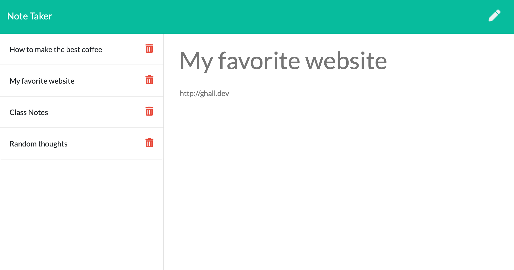

# note-taker

## Description

We all need to jot down notes once in a while, for work, school, or just in our daily lives. Note-taker is an express-based web app that allows you to quickly and simply jot down notes, and quickly recall them. 

## Table of Contents

- [Installation](#installation)
- [Usage](#usage)
- [License](#license)
- [Questions](#usage)

## Installation

- Install node if you don't already have it
- Clone this repo
- Navigate to the repo's location on your computer in your terminal
- Run the `npm install` command and wait for the process to finish
- Run `npm start` and navigate to `localhost:3001` in your web browser

## Usage

[🔗 Deployed Link](https://safe-springs-88279.herokuapp.com)

- Click "Get Started" to go to the notes page
- Click the pencil ✏️ icon to start a new note
- Click the save 💾 icon that appears to save the note
- Click the name of any note to display the note
- Click the trash can 🗑️ to delete the note

## License

Team Profile Builder
Copyright (C) 2021  Graham Hall

This program is free software: you can redistribute it and/or modify
it under the terms of the GNU General Public License as published by
the Free Software Foundation, either version 3 of the License, or
(at your option) any later version.

This program is distributed in the hope that it will be useful,
but WITHOUT ANY WARRANTY; without even the implied warranty of
MERCHANTABILITY or FITNESS FOR A PARTICULAR PURPOSE.  See the
GNU General Public License for more details.

You should have received a copy of the GNU General Public License
along with this program.  If not, see <https://www.gnu.org/licenses/>.

## Questions

Direct any questions to [Graham Hall](http://github.com/ghall89) via email at ✉️ ghall89@me.com